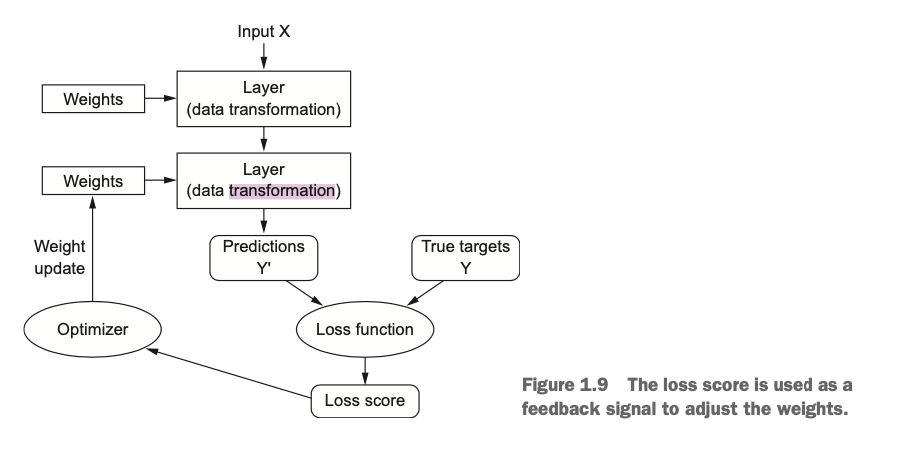

# overview

机器学习和统计密切相关,但是和统计有很大的区别.

尤其是深度学习,更多的是面向工程,由经验来验证结论,
其中的数学知识是相对**少的**,
而不是像统计学那样有严密的数学逻辑来支撑.

实际上,机器学习是一个很简单的想法,但是能够产生解决
广泛的问题的解决方案.

> what machine learning is, technically: searching for useful representa- tions of some input data, within a predefined space of possibilities, using guidance from a feedback signal. This simple idea allows for solving a remarkably broad range of intellectual tasks, from speech recognition to autonomous car driving.

机器学习即: 在一个预先定义的解空间中, 使用反馈信息作为指导,
来搜索输入数据的有意义的表示.

## 基本概念

### 损失函数 loss function / 目标函数 objective function

模型预测值和实际真实值之间的差值

### optimizer

神经网络中的反馈调节算法, 根据 loss function,
对网络中的权重进行调整.

正是有了 optimizer, 网络的学习才有了可能.

[page 37]
