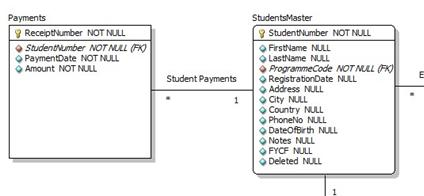

# concepts

## unique constraint

unique constraint make sure one can not insert duplicated item in the contraint column(s).
And when a `unique constraint` is created, a `unique index` on that is automatically created too.

## design normal forms

### 1st normal form

#### rules

- 每一列只包含一个值
- 每一行都是唯一的

### 2st normal form

#### 概念

- 主键，复合主键
- 外键

#### rules

- 符合 第一范式
- 每一行都有一个 主键 primarykey

### 3st normal form

#### concepts

- transive functional dependencies 传递行为依赖

> 想要改变一个非键的列， 可能同时需要改变其他的列

#### rules

- 符合第二范式
- 没有传递行为依赖

  > 即 消除列之间的依赖关系

## er modeling

er(Entity Relation) model 实体关系建模
对实体，实体的属性，与其他实体的关系进行建模。

### eer modeling

eer(Enhanced Entity Relation) modeling 强化实体关系建模。
使用 uml 对复杂的实体关系进行建模。

