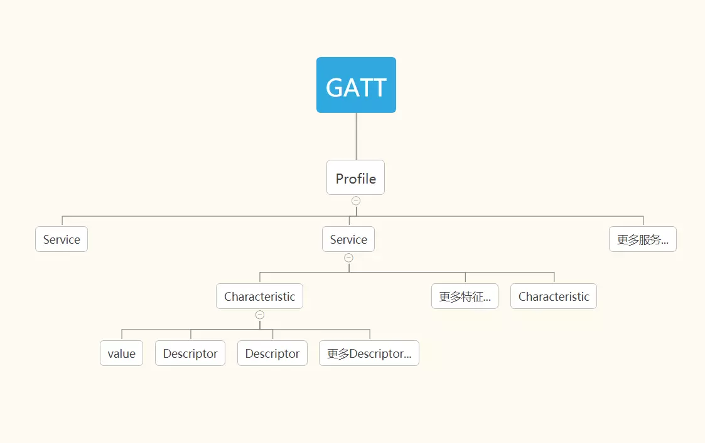
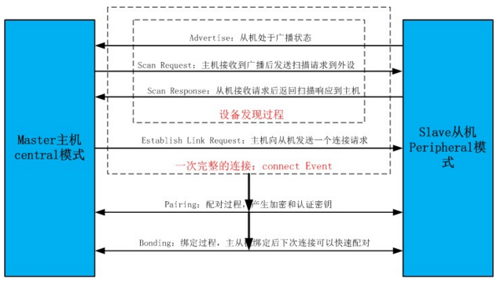
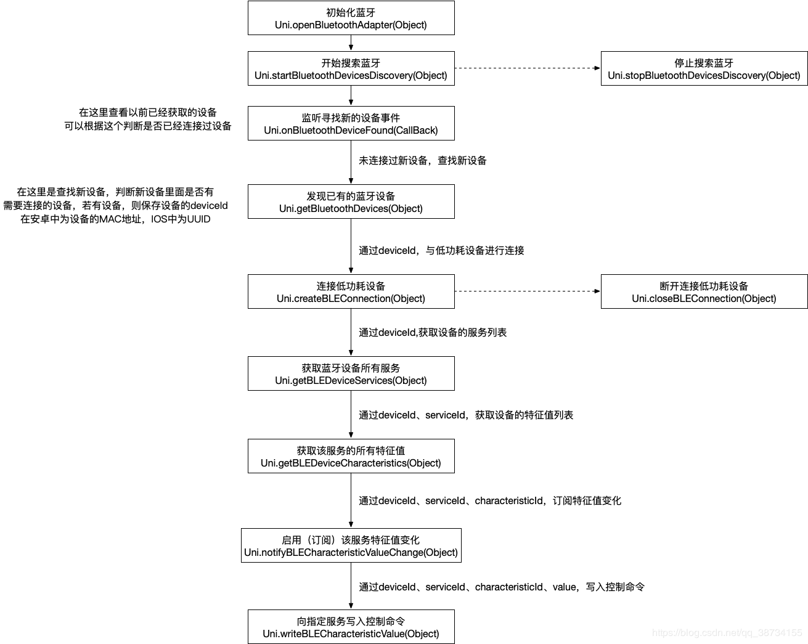

# bluetooth

## 协议

### 蓝牙 4.0 协议

4.0 协议将传统蓝牙，低功耗蓝牙，高速蓝牙集中到一起，可以从三种模式中进行切换，从而提供更
广泛的应用空间。

### 蓝牙 4.1 协议

4.1 协议主要面向 IOT(Internet Of Things), 支持多设备互联

而且可以直接使用 IPv6 的通道，连接互联网，

## profile

每个蓝牙设备包含一个 profile（配置文件），
profile 中包含一个或者多个`service`(服务）， service 可以理解为设备具有的一种能力，
例如，一个设备可能同时提供电量信息服务 BatteryService, 以及音量大小服务 VolumeService.

一个 service 包含一个或者多个`characteristic`(特征).
`characteristic`可以理解为服务的属性，一个`characteristic`包括一个 value(array of bytes)，
以及多个可选的`descriptor`.
`descriptor`包含一个 value（array of bytes），用来描述或者配置它的`characteristic`.

特征是与外界交互的最小单位。
蓝牙设备硬件厂商通常都会提供他们的设备里面各个服务(service)和特征(characteristics)的功能，
比如哪些是用来交互(读写)，哪些可获取模块信息(只读)等。
比如说，一台蓝牙 4.0 设备，用特征 A 来描述自己的出厂信息，用特征 B 来与收发数据等。

主机和从机通过`characteristic`来进行通信。

每个`service`和`characteristics`都由一个`UUID`来标识。

### GATT(Generic ATTributes) 通用属性协议

SIG 定义了一些标准的通用属性配置文件 .

例如，电池信息和血压测量，都有相应的定义。

以血压[Blood Pressure Profile](https://www.bluetooth.org/docman/handlers/downloaddoc.ashx?doc_id=457086)为例, TODO

## 连接过程

1, 建立中心角色—

2,扫描外设（discover）（通过接收从设备广播来扫描、发现设备，获得 peripheral ID）—

- a, 如果数据中已经和某些蓝牙设备绑定，可以使用 BluetoothAdapter.getBondedDevices();方法获得已经绑定的蓝牙设备列表。通过指定特定的 peripheral 的 UUID,central 只会 discover 这个特定的设备。
- b, 搜索周围的蓝牙设备受用 BluetoothAdapter.startDiscovery()方法
- c, 搜索到的蓝牙设备都是通过广播返回，需要注册广播接收器来获得已经搜索到的蓝牙设备

3,连接外设(connect)（根据 peripheral ID 连接指定的外设）—

4,扫描外设中的服务和特征(discover)（一个设备里的服务和特征往往比较多，一般会在发现服务和特征的回调里通过 service、characteristic UUID 去匹配我们关心那些）—

5, 与外设做数据交互(explore and interact)—

6, 断开连接(disconnect)。

## 平台支持情况

### web

web 跟 bluetooth 相关的 api 仍处于 draft 状态。即使是 chrome 也仅支持有限的 api.

出于 web 安全性和开放性的考虑，web bluetooth 不支持跨连接的持久性，即[断开设备连接后必须重新配对](https://webbluetoothcg.github.io/web-bluetooth/#persistence)（？）

### 原生 TODO

ios 通过`coreBluetooth`提供相应的 api

android

### 小程序

微信将原生的蓝牙能力暴露给小程序，可以使用相关的 api。
只支持 BLE 蓝牙设备,不支持经典蓝牙.

例如,蓝牙耳机一般属于经典蓝牙, 小程序的蓝牙能力搜索不到.

### flutter

有相关的插件，但是特性支持不够完整。

## 硬件情况

可穿戴设备,以及其他测量设备,一般都是低功耗蓝牙设备,需要 central 设备支持蓝牙 4.0 以上.

有些蓝牙设备除了可以直接连接, 也有自己的硬件平台,例如小米手环.

## demos

- [web](https://dum3ng.github.io/blue_web_simple/)
- [miniapp](https://github.com/dum3ng/bluetooth_miniapp)

## 血压仪设备具体过程

### 存在的问题

- 如何知道设备测量血压的 serviceId? 每种血压仪的 serviceId 是否一致?
- 如何知道特征 characteristicid?
- 如何解析获取的特征值? 其数据结构是否对各个血压仪一致?
- 一次传输只能传输 20 个 byte, 对于内置存储的血压设备如何获取所有的数据?

## 其他相关

### SIG

蓝牙技术联盟(Bluetooth Special Interest Group, Bluetooth SIG)是一个以制定蓝牙规范，以推动蓝牙技术为宗旨的跨国组织。它拥有蓝牙的商标，负责认证制造厂商，授权他们使用蓝牙技术与蓝牙标志，但是它本身不负责蓝牙装置的设计、生产及贩售。

### 小米 app 如何和手环配对

实质上仍然是使用蓝牙来配对.
通过对信号强度的计算, 可以判断手环和中心设备(手机)的大致距离,
当相当近时, app 再和手环进行配对.

## references

- [微信小程序-蓝牙连接](https://www.cnblogs.com/guhonghao/p/9947144.html)
- [Gadgetbridge](https://github.com/Freeyourgadget/Gadgetbridge)
- [微信小程序之蓝牙 BLE 踩坑记录](https://www.jianshu.com/p/42a8f71110e8)
- [GATT Profile 简介](https://blog.csdn.net/chunqingtai2922/article/details/101028816?utm_medium=distribute.pc_relevant_right.none-task-blog-BlogCommendFromBaidu-11&depth_1-utm_source=distribute.pc_relevant_right.none-task-blog-BlogCommendFromBaidu-11)
- [finding-out-android-bluetooth-le-gatt-profiles](https://stackoverflow.com/questions/18699251/finding-out-android-bluetooth-le-gatt-profiles)
- [bluetooth specifications - assigned numbers](https://www.bluetooth.com/specifications/assigned-numbers/)
- [bloodpressure service specification](https://www.bluetooth.com/xml-viewer/?src=https://www.bluetooth.com/wp-content/uploads/Sitecore-Media-Library/Gatt/Xml/Services/org.bluetooth.service.blood_pressure.xml)
- [Uni-App 使用低功耗蓝牙连接血压仪测量](https://blog.csdn.net/msy_msy/article/details/94015449)
